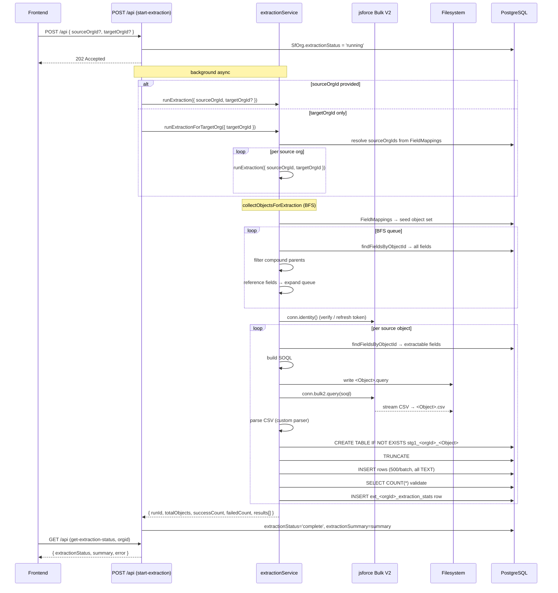
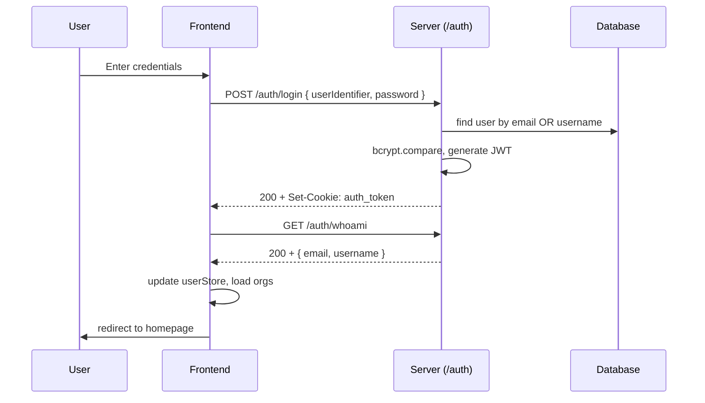
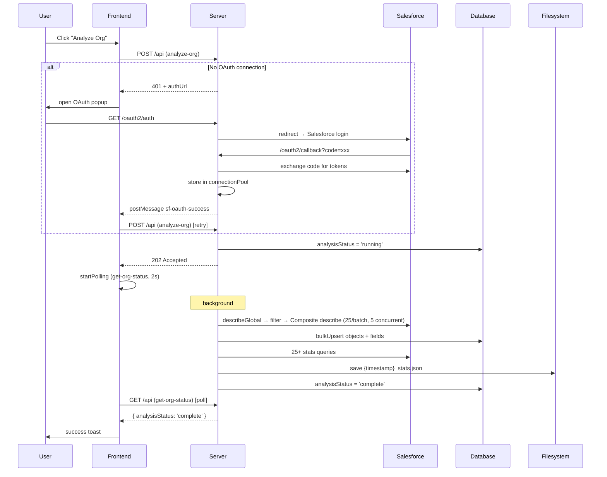
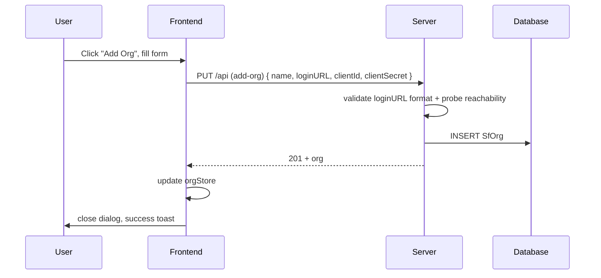
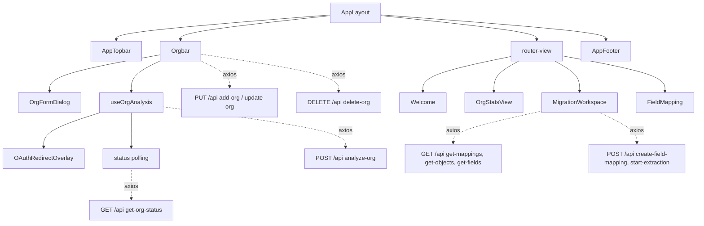

# SF Migrator — Architecture

> **Last updated**: 2026-06-22
> **Status**: Active implementation

---

## Table of Contents

1. [System Overview](#system-overview)
2. [Technology Stack](#technology-stack)
3. [Application Architecture](#application-architecture)
4. [Frontend Architecture](#frontend-architecture)
5. [Backend Architecture](#backend-architecture)
6. [Stage 1 Extraction (STG1)](#stage-1-extraction-stg1)
7. [Transformation Rule DSL](#transformation-rule-dsl)
8. [API Specification](#api-specification)
9. [Data Flow Diagrams](#data-flow-diagrams)
10. [Authentication & Authorization](#authentication--authorization)
11. [Salesforce Integration](#salesforce-integration)
12. [Database Schema](#database-schema)
13. [Design Patterns & Best Practices](#design-patterns--best-practices)

---

## System Overview

**SF Migrator** is a full-stack web application for Salesforce-to-Salesforce data migrations.

### Implementation Status

✅ **Complete**:
- User authentication and authorization (JWT + httpOnly cookies)
- Org CRUD + OAuth2 Salesforce connection flow
- Metadata analysis (objects & fields via Composite API)
- Org statistics (25+ health queries saved to filesystem)
- Real-time analysis status polling
- Migration Workspace UI:
  - Object/field mapping with as-is / expression / constant types
  - Multi-field search (label + API name + type)
  - Collapsible metadata panels, record types viewer, picklist values viewer
  - Decoupled `metadataStore` (Map-based caching) and `mappingStore`
- **Stage 1 Extraction (v1.0.0)**:
  - BFS object discovery from mapping pairs (transitively follows reference fields)
  - Per-object SOQL generation with compound field filtering
  - Bulk V2 jsforce streaming directly to CSV on disk
  - Dynamic PostgreSQL staging tables (`stg1_<orgId>_<Object>`)
  - Per-org extraction stats table (`ext_<orgId>_extraction_stats`)
  - Async 202 pattern — `extractionStatus` polling (idle → running → complete / failed / auth_failed)
  - Per-object resilience — one failure does not abort the run

🚧 **In Development**:
- Data migration execution (Stage 2)
- Field mapping edit dialog
- Field type compatibility validation
- Extraction results UI (object counts, field counts, record counts, errors)

---

## Technology Stack

### Frontend

| Technology | Version | Purpose |
|------------|---------|---------|
| Vue.js | 3.4.34 | Progressive JavaScript framework |
| Vite | 6.3.5 | Build tool and dev server (port 5173) |
| Vue Router | 4.4.0 | Client-side routing with guards |
| Pinia | 3.0.2 | State management with persistence |
| Axios | 1.8.4 | HTTP client with interceptors |
| PrimeVue | 4.3.3 | UI component library (Aura theme) |
| TailwindCSS | 3.4.6 | Utility-first CSS framework |
| SCSS | — | CSS preprocessor |

### Backend

| Technology | Version | Purpose |
|------------|---------|---------|
| Node.js | — | Runtime environment |
| Express | 4.21.2 | Web application framework |
| Sequelize | 6.37.7 | PostgreSQL ORM |
| PostgreSQL | — | Relational database |
| jsforce | 3.6.5 | Salesforce API integration |
| JWT | 9.0.2 | Token-based authentication |
| bcrypt | 6.0.0 | Password hashing |
| dotenv | 16.4.7 | Environment configuration |

---

## Application Architecture

### High-Level Diagram

```
┌───────────────────────────────────────────────────────────────┐
│                         CLIENT (Browser)                      │
│  ┌─────────────────────────────────────────────────────────┐  │
│  │                    Vue 3 SPA (Port 5173)                │  │
│  │  ┌────────────┐  ┌──────────┐  ┌───────────────────┐   │  │
│  │  │   Router   │  │  Stores  │  │   Components      │   │  │
│  │  │  (Guards)  │  │ (Pinia)  │  │  (Composition API)│   │  │
│  │  └────────────┘  └──────────┘  └───────────────────┘   │  │
│  │                        │                               │  │
│  │                 ┌──────▼────────┐                      │  │
│  │                 │ Axios Instance│                      │  │
│  │                 │ (Interceptors)│                      │  │
│  │                 └──────┬────────┘                      │  │
│  └────────────────────────┼───────────────────────────────┘  │
└────────────────────────────┼──────────────────────────────────┘
                             │ HTTP/HTTPS (withCredentials: true)
┌────────────────────────────▼──────────────────────────────────┐
│                    SERVER (Port 3000)                         │
│  ┌─────────────────────────────────────────────────────────┐  │
│  │  Middleware: CORS · JSON Parser · Request Tracer        │  │
│  │  Routes: /auth (public) · /api (protected) · /oauth2   │  │
│  │  Services: salesforceService · metadataService          │  │
│  │            orgStatsService · filesystemService          │  │
│  │            extractionService · mappingService           │  │
│  │  Repositories: userRepo · orgRepo · metadataRepo        │  │
│  │  Models (Sequelize): User · SfOrg · SfObjectMetadata    │  │
│  │                      SfFieldMetadata · FieldMapping     │  │
│  └─────────────────────────────────────────────────────────┘  │
└────────────────────────────┬──────────────────────────────────┘
                             │
┌────────────────────────────▼───────────────────────────────────┐
│  PostgreSQL Database                                           │
│  Sequelize models + dynamic runtime tables (stg1_*, ext_*)    │
└────────────────────────────┬───────────────────────────────────┘
                             │
┌────────────────────────────▼───────────────────────────────────┐
│  Salesforce Orgs (via jsforce)                                 │
│  OAuth2 · Metadata API · Composite API · Bulk V2               │
└────────────────────────────────────────────────────────────────┘
```

---

## Frontend Architecture

### Entry Point

**File**: `src/main.js`

```
Vue App Initialization
  ├─ Pinia (with localStorage persistence plugin)
  ├─ Vue Router (with navigation guards)
  ├─ PrimeVue (Aura theme, dark mode support)
  ├─ Toast Service
  ├─ Confirmation Service
  └─ Mount to #app
```

### Routing

**File**: `src/router/index.js`

| Route | Component | Auth Required | Purpose |
|-------|-----------|---------------|---------|
| `/welcome` | Welcome.vue | ✅ | Landing page |
| `/org-stats` | OrgStatsView.vue | ✅ | Org statistics |
| `/migration-workspace` | MigrationWorkspace.vue | ✅ | Field mapping UI |
| `/field-mapping/:mappingId` | FieldMapping.vue | ✅ | Mapping detail view |
| `/auth/login` | auth/Login.vue | ❌ | Login |
| `/auth/register` | auth/Register.vue | ❌ | Registration |
| `/auth/access` | auth/Access.vue | ❌ | Access denied |

**Navigation Guard**: Calls `isLoggedIn()` (GET /auth/whoami) before each authenticated route. Redirects to `/auth/login` if unauthenticated.

### Component Hierarchy

```
App.vue
  └─ <router-view>
      ├─ AppLayout.vue (authenticated routes)
      │   ├─ AppTopbar.vue (logo, dark mode toggle, user menu, logout)
      │   ├─ Orgbar.vue (org selector, Add/Edit/Delete/Analyze buttons)
      │   │   ├─ OrgFormDialog.vue
      │   │   └─ OAuthRedirectOverlay.vue
      │   ├─ <router-view> (page content)
      │   │   ├─ Welcome.vue
      │   │   ├─ OrgStatsView.vue → OrgStats.vue
      │   │   ├─ MigrationWorkspace.vue
      │   │   └─ FieldMapping.vue
      │   └─ AppFooter.vue
      └─ Auth Views (no layout)
          ├─ Login.vue
          ├─ Register.vue
          └─ Access.vue
```

### MigrationWorkspace.vue

The primary working view for configuring migrations:

- Source/target org selection with analysis status checks
- Object dropdowns (multi-field search: label + API name)
- Field dropdowns (multi-field search: label + API name + type)
- Comprehensive metadata display with collapsible detail panels
- Record types viewer and picklist values viewer (modals)
- Field mapping creation: as-is, expression, constant types
- Uses `metadataStore` for object/field caching, `mappingStore` for mapping state

### State Management (Pinia Stores)

#### userStore.js
```
State:    isAuthenticated, email, username, serverDown
Actions:  setEmail, setUsername, setIsAuthenticated
Persist:  ✅ localStorage
```

#### orgStore.js
```
State:    orgs[], selectedOrg, showEditOrgDialog, showAddOrgDialog
Actions:  loadOrgs(), setSelectedOrg(), deleteOrg(), getOrgStats()
Persist:  ✅ localStorage
```

#### mappingStore.js
```
State:    fieldMappings[], loading, error
Actions:  loadMappings(sourceOrgId, targetOrgId?)
          createFieldMapping(data)
          updateFieldMapping(mappingId, updates)
          deleteFieldMapping(mappingId)
          clearMappings()
Persist:  ❌ session-only
```

#### metadataStore.js
```
State:    objectsByOrg: Map<orgId, SfObjectMetadata[]>
          fieldsByObject: Map<objectId, SfFieldMetadata[]>
Actions:  loadObjects(orgId), loadFields(objectId)
          getObjects(orgId), getFields(objectId)
          clearCache(), clearOrgCache(orgId)
Persist:  ❌ in-memory only
Note:     O(1) Map lookups, decoupled from mappingStore
```

### Composables

#### useAuth.js (`src/composables/auth/`)
```
login(email, password)  → POST /auth/login → GET /auth/whoami → update stores
isLoggedIn()            → GET /auth/whoami → true/false (used by router guard)
```

#### useOrgAnalysis.js
```
State:    analyzingOrgId, hasAnalysis, showingOAuthOverlay, oauthOrgName

doAnalysis()
  → POST /api (action: analyze-org)
  → On 401: triggerOAuthRedirect() → OAuth popup → retry
  → On 202: startPolling()

startPolling(orgId)
  → GET /api (action: get-org-status) every 2s
  → Stops on complete/failed, shows toast

triggerOAuthRedirect(authUrl, orgId)
  → Opens popup window
  → Waits for window.postMessage({ type: 'sf-oauth-success' })
```

### API Client

**File**: `src/api/axiosInstance.js`

```
baseURL:          VITE_API_URL (http://localhost:3000)
withCredentials:  true
validateStatus:   status < 500  (4xx not thrown, handled by caller)

Request interceptor:  generates X-Request-ID (8-char UUID), logs request
Response interceptor: logs response, does NOT auto-redirect on 401

Key headers sent:
  Content-Type:   application/json
  X-Request-ID:   <uuid>
  action:         <action-name>
  orgid:          <org-uuid>      (org-scoped requests)
  objectid:       <object-uuid>   (object-scoped requests)
```

---

## Backend Architecture

### Server Entry Point

**File**: `SERVER/src/server.js`

```
├─ Load .env.{NODE_ENV}
├─ CORS (FRONTEND_URL origin, credentials: true)
├─ JSON body parser
├─ requestTracer middleware
├─ Routes:
│   ├─ /auth          → auth.js (public)
│   ├─ /api           → api.js  (protected: authMiddleware)
│   └─ /              → oauth routes
└─ Listen PORT 3000
```

### Middleware

#### requestTracer.js
Generates or extracts `X-Request-ID` header, stores in `AsyncLocalStorage`. All downstream code (especially the logger) reads it without parameter passing.

#### authMiddleware.js
Extracts `auth_token` cookie → `jwt.verify(token, JWT_SECRET)` → attaches `req.user = { id, email, username, role }`. Returns 401 on missing/invalid/expired token.

### Routes

#### auth.js (public)

| Method | Path | Purpose |
|--------|------|---------|
| POST | `/auth/login` | Login with email or username + password |
| POST | `/auth/register` | Register new user |
| GET | `/auth/whoami` | Validate token, return user data |
| GET | `/auth/logout` | Clear auth cookie |

#### api.js (protected — action header required)

**GET `/api`**

| Action | Headers | Purpose |
|--------|---------|---------|
| `get-orgs` | — | All orgs for current user |
| `get-objects` | `orgid` | Objects for org |
| `get-fields` | `objectid` | Fields for object |
| `get-org-status` | `orgid` | Analysis status + authUrl if needed |
| `get-org-stats` | `orgid` | Org stats JSON (from filesystem) |
| `get-extraction-status` | `orgid` | Extraction status + summary + error |
| `get-mappings` | `orgid` (source) | Field mappings for source org |

**POST `/api`**

| Action | Purpose | Response |
|--------|---------|----------|
| `analyze-org` | Start metadata analysis (async) | 202 |
| `start-extraction` | Start Stage 1 extraction (async) | 202 |
| `test-sf-connection` | Test Salesforce connection | 200 |
| `create-field-mapping` | Create a new FieldMapping | 201 |

**PUT `/api`**

| Action | Purpose |
|--------|---------|
| `add-org` | Create new SfOrg |
| `update-org` | Update SfOrg fields |
| `update-field-mapping` | Update an existing FieldMapping |

**DELETE `/api`**

| Action | Purpose |
|--------|---------|
| `delete-org` | Delete org + all metadata |
| `delete-field-mapping` | Delete a FieldMapping |

#### OAuth routes

| Method | Path | Purpose |
|--------|------|---------|
| GET | `/oauth2/auth?sfOrgId=<id>&returnTo=<url>` | Start OAuth — probe loginURL, redirect to Salesforce |
| GET | `/oauth2/callback?code=<code>&state=<state>` | Exchange code, store connection, postMessage to opener |

### Services Layer

#### salesforceService.js
Manages the jsforce connection pool used for analysis and OAuth.

```
connectionPool: Map<sfOrgId, Connection>
oauth2Map:      Map<sfOrgId, OAuth2>

connectToOrg(sfOrgId)         → cached connection or throws OAuthRequiredError
beginOAuth(sfOrgId, returnTo)  → creates OAuth2 session, returns authorizationUrl
completeOAuth(sfOrgId, code)   → exchanges code, stores connection, returns user info
cancelOAuth(sfOrgId)           → cleans up pending session

describeGlobal(sfOrgId)                    → conn.describeGlobal()
describeObjectMultiple(sfOrgId, names[])   → Composite API, 25/batch, 5 concurrent
getRecordCounts(sfOrgId, names[])          → Composite SOQL COUNT() queries
```

Composite API batching: 500 objects → 20 requests → 4 batches of 5 concurrent ≈ 10s vs 10+ min sequential.

#### metadataService.js

```
analyzeAndSaveOrg(sfOrgId, options)
  1. describeGlobal → all sobjects
  2. Filter: hardcoded exclusions (config/objectsToExclude.js)
             pattern exclusions (/Share$/, /History$/, /Feed$/)
             optional user-provided object list
  3. describeObjectMultiple (batched Composite API)
  4. metadataRepo.bulkUpsertObjects() + bulkUpsertFields()
```

#### orgStatsService.js
Runs 25+ SOQL/REST queries and saves results to disk.

```
calculateAndSaveOrgStats(conn, orgId)
  → queries: user counts, active users, licenses, limits, storage,
             custom objects/fields, Apex, flows, LWC, Aura, VF pages,
             dangerous profiles, record types, etc.
  → saves to: SERVER/data/{orgId}/{timestamp}_stats.json
```

#### filesystemService.js
```
saveOrgStatsToFile(orgId, stats)  → SERVER/data/{orgId}/{timestamp}_stats.json
getLatestOrgStats(orgId)          → reads latest file (alphabetical sort) → parsed JSON
```

#### mappingService.js
Queries FieldMappings with associated source/target object and field metadata.

```
getObjectMappingsBySourceOrg(sourceOrgId)
getObjectMappingsByOrgPair(sourceOrgId, targetOrgId)
getObjectMappingsByTargetOrg(targetOrgId)
getFieldMappingsBySourceOrg(sourceOrgId)
getFieldMappingsByOrgPair(sourceOrgId, targetOrgId)
getFieldMappingsByObjectMapping(mappingId)
```

#### extractionService.js
See [Stage 1 Extraction](#stage-1-extraction-stg1) for full detail.

```
runExtraction({ sourceOrgId, targetOrgId? })
  → BFS object discovery, per-object Bulk V2 export, dynamic DB load

runExtractionForTargetOrg({ targetOrgId })
  → resolves all source orgs from FieldMappings, calls runExtraction() for each
```

### Repositories Layer

Only repositories touch Sequelize models directly.

#### userRepository.js
`findById` · `findByEmail` · `findByUsername` · `create` · `update` · `updateLastLogin`

#### orgRepository.js
`findById` · `findByUserId` · `create` · `update` · `delete` · `updateAnalysisStatus`
(sets `analysisStartedAt` when status = `'running'`)

#### metadataRepository.js
```
findObjectsByOrgId(sfOrgId)
findObjectById(id, { includeFields? })
findFieldsByObjectId(objectMetadataId)
deleteObjectsByOrgId(sfOrgId)
bulkUpsertObjects(sfOrgId, rows)   → updateOnDuplicate on [sfOrgId, name]
bulkUpsertFields(rows)             → updateOnDuplicate on [objectMetadataId, name]
```

### Models Layer

All primary keys are UUID v4.

#### User
```javascript
{ id, email (unique), username (unique), password (bcrypt),
  firstname, lastname, role: ENUM('user','admin'),
  isActive, emailVerified, lastLogin,
  resetPasswordToken, resetPasswordExpires }
```

#### SfOrg
```javascript
{ id, userId (FK→User), name, description, loginURL,
  connectionType: ENUM('OAuth'),
  clientId, clientSecret, instanceUrl, accessToken, refreshToken,
  analysisStatus: ENUM('idle','running','complete','failed','auth_required'),
  analysisStartedAt,
  extractionStatus: ENUM('idle','running','complete','failed','auth_failed'),
  extractionSummary: JSONB,
  extractionError: TEXT }
```

#### SfObjectMetadata
```javascript
{ id, sfOrgId (FK→SfOrg), name (API name), label, labelPlural,
  custom, customSetting, queryable, createable, updateable,
  deleteable, triggerable, ... (50+ describe fields),
  recordCount, lastAnalyzed }
// Unique index: [sfOrgId, name]
```

#### SfFieldMetadata
```javascript
{ id, objectMetadataId (FK→SfObjectMetadata), name, label,
  type, length, precision, scale, custom, required, unique,
  externalId, calculated, compoundFieldName, referenceTo: JSONB,
  ... (40+ describe properties),
  picklistValues: JSONB,
  isFormula: BOOLEAN GENERATED ALWAYS AS (calculated = true) STORED,
  isRollUpSummary: BOOLEAN GENERATED ALWAYS AS (type = 'summary') STORED }
// Unique index: [objectMetadataId, name]
```

#### FieldMapping
```javascript
{ id,
  sourceObjectId (FK→SfObjectMetadata),
  targetObjectId (FK→SfObjectMetadata),
  sourceFieldId  (FK→SfFieldMetadata, nullable for constant type),
  targetFieldId  (FK→SfFieldMetadata),
  mappingType: ENUM('as-is', 'expression', 'constant'),
  transformationRule: TEXT,
  constantValue: TEXT }
// Note: no ObjectMapping parent — object scope is carried directly on FieldMapping
```

#### Runtime tables (no Sequelize model)

| Pattern | Purpose |
|---------|---------|
| `stg1_<orgId>_<Object>` | Stage 1 extracted data; all columns TEXT |
| `ext_<orgId>_extraction_stats` | Per-object extraction run stats |

---

## Stage 1 Extraction (STG1)

### API trigger (async pattern)

`POST /api` with `action: start-extraction`, body `{ sourceOrgId?, targetOrgId? }`

- Provide `sourceOrgId` → extract one source org (optionally scoped to mappings with `targetOrgId`).
- Provide only `targetOrgId` → auto-discover all source orgs mapped to that target and extract each.
- Route sets `SfOrg.extractionStatus = 'running'`, returns **202 Accepted immediately**, runs in background.
- On finish: writes `extractionStatus = 'complete'` + full `extractionSummary` JSON to `SfOrg`.
- On failure: writes `extractionStatus = 'failed'` (or `'auth_failed'`) + `extractionError`.
- Frontend polls `GET /api` with `action: get-extraction-status` + `orgid` header.

### Object collection (`collectObjectsForExtraction`)

Object scope is built via breadth-first traversal:

```
1. Seed queue: all sourceObjectIds from FieldMappings
   (scoped to source org, optionally filtered by targetOrgId)

2. Load all SfObjectMetadata for the source org once → Map<name, {id,name,label}>

3. For each object in queue (BFS):
   a. Load ALL SfFieldMetadata rows
   b. Build compoundParentNames set:
      - Any field name that appears as another field's compoundFieldName is a parent
      - Remove parents (e.g. BillingAddress) — keep components (BillingStreet, etc.)
   c. For each remaining field where:
        type IN ('reference', 'lookup', 'masterdetail')  OR  referenceTo[] non-empty
      → extract up to 10 target object names from referenceTo[]
      → if object exists in source org metadata AND not already in extraction set
        → add to set + enqueue (transitive reference closure)

4. Repeat until queue empty
```

### Connection setup (per source org)

A dedicated `jsforce.Connection` is created per source org — not reused from the analysis pool:

```javascript
const oauth2 = new jsforce.OAuth2({
  loginUrl:    sourceOrg.loginURL,
  clientId:    sourceOrg.clientId,
  clientSecret: sourceOrg.clientSecret,
  redirectUri: process.env.SF_REDIRECT_URI,
});
const conn = new jsforce.Connection({
  oauth2,
  instanceUrl:  sourceOrg.instanceUrl || sourceOrg.loginURL,
  accessToken:  sourceOrg.accessToken,
  refreshToken: sourceOrg.refreshToken,
  version: '66.0',
});
```

`conn.identity()` is called before extraction starts. If the token is expired, jsforce auto-refreshes it; updated tokens are written back to the database.

### Per-object extraction flow

```
1.  DB       → metadataRepo.findFieldsByObjectId(objectId)

2.  Filter   → build compoundParentNames (same logic as collection step above)
             → remove compound parents, deduplicate field names
             → ensure 'Id' is first

3.  SOQL gen → SELECT <field1>, <field2>, ... FROM <ObjectApiName>
             → API name case preserved

4.  FS write → SERVER/data/<sourceOrgId>/Extraction/SOQL_Queries/<Object>.query
             → plain text via fs.writeFile

5.  Bulk V2  → conn.bulk2.query(soql)  → recordStream
             → recordStream.stream().pipe(createWriteStream(csvPath))
             → no sf CLI process; pure jsforce streaming

6.  FS out   → SERVER/data/<sourceOrgId>/Extraction/<Object>.csv
             → written by the stream; no in-memory accumulation

7.  CSV parse → custom in-process parser (no external deps)
             → handles quoted fields, escaped "" inside quotes
             → strips UTF-8 BOM from first header cell
             → row[0] = headers, rows[1..] = data

8.  DB table → CREATE TABLE IF NOT EXISTS "<stg>" (<col> TEXT, ...)
             → ALTER TABLE ... ADD COLUMN IF NOT EXISTS for any new columns
             → column names: non-alphanumeric → '_'
             → table name: stg1_<orgId>_<ObjectName>
               (if > 63 chars: stg1_<orgId>_<trimmed>_<sha1[0:8]>)

9.  Truncate → TRUNCATE TABLE "<stg>"

10. Insert   → batched raw SQL, 500 rows/batch
             → all values stored as TEXT
             → positional $N parameterized bindings

11. Validate → SELECT COUNT(*)::int — must equal CSV row count
             → throws on mismatch (object marked 'failed', run continues)

12. Stats    → INSERT into ext_<orgId>_extraction_stats
             → columns: runId, sourceObjectId, objectName,
                fieldsExported (JSONB), status, startedAt, finishedAt,
                recordsExported, queryFilePath, csvFilePath,
                stg1TableName, errorMessage
```

Each object runs inside its own try/catch. A failure sets `status: 'failed'` with `errorMessage` and continues to the next object.

### Filesystem layout

```
SERVER/data/<sourceOrgId>/
  Extraction/
    SOQL_Queries/
      Account.query        ← plain SOQL text
      Contact.query
      ...
    Account.csv            ← Bulk V2 CSV export
    Contact.csv
    ...
```

Directory created with `fs.mkdir(..., { recursive: true })`. Characters invalid in filenames (`< > : " / \ | ? *`) replaced with `_`.

### Database tables (runtime-created)

| Pattern | Purpose |
|---------|---------|
| `stg1_<orgId>_<ObjectName>` | Extracted data; all columns TEXT; truncated per run |
| `ext_<orgId>_extraction_stats` | Per-object stats for every extraction run |

Names > 63 chars: `stg1_<orgId>_<trimmedName>_<sha1[0:8]>`.

### Deferred

Wide-object split/merge fallback (objects that hit Bulk V2 column limits) is deferred. Current behavior: mark that object `failed`, continue.

### Sequence diagram



---

## Transformation Rule DSL

`FieldMapping.transformationRule` is a lightweight expression DSL for `mappingType = 'expression'` mappings.

**Syntax**:

| Pattern | Description |
|---------|-------------|
| `{SRCObject.SRCField}` | Direct field copy |
| `{SRCObject.Field1 \|\| SRCObject.Field2}` | Concatenation |
| `{SUBSTR(SRCObject.Field, 2, 5)}` | Substring (1-based, inclusive) |
| Nested combinations | `SUBSTR` can wrap concatenations and vice-versa |

**Rules**:
- Expression must start with `{` and end with `}`.
- `SUBSTR(expr, start, end)` — 1-based positions, inclusive.
- Missing/null source values treated as empty strings.
- Rule syntax is validated on save for `expression` mappings.

---

## API Specification

### Auth (Public)

```http
POST /auth/login
Body: { userIdentifier, password }          ← email OR username accepted
→ 200 { email, username } + Set-Cookie: auth_token (HttpOnly, 12h)

POST /auth/register
Body: { email, password, firstname, lastname, username }
→ 201 { email, username }

GET /auth/whoami
→ 200 { email, username }  |  401

GET /auth/logout
→ 200 + clears auth_token cookie
```

### Org Management (Protected)

```http
GET /api   action: get-orgs
→ 200 Array<SfOrg>  (clientId/clientSecret masked)

PUT /api   action: add-org
Body: { name, description, loginURL, clientId?, clientSecret? }
→ 201 SfOrg

PUT /api   action: update-org   orgid: <uuid>
Body: { name?, description?, loginURL?, clientId?, clientSecret? }
→ 200

DELETE /api   action: delete-org   orgid: <uuid>
→ 200
```

### Metadata & Analysis (Protected)

```http
POST /api   action: analyze-org
Body: { orgId, options?: { objectsToAnalyze?, includeCustomOnly? } }
→ 202 { analysisStatus: 'running' }
→ 401 { authUrl }   (if no OAuth connection)

GET /api   action: get-org-status   orgid: <uuid>
→ 200 { analysisStatus, analysisStartedAt, authUrl? }

GET /api   action: get-objects   orgid: <uuid>   [?includeFields=true]
→ 200 Array<SfObjectMetadata>

GET /api   action: get-fields   objectid: <uuid>
→ 200 Array<SfFieldMetadata>

GET /api   action: get-org-stats   orgid: <uuid>
→ 200 stats JSON (user counts, limits, custom objects, Apex, flows, etc.)
```

### Extraction (Protected)

```http
POST /api   action: start-extraction
Body: { sourceOrgId?, targetOrgId? }
  — sourceOrgId provided → extract that source org (targetOrgId is optional scope)
  — only targetOrgId    → auto-discover all mapped source orgs and extract each
→ 202 { extractionStatus: 'running' }
→ 400 if neither id provided

GET /api   action: get-extraction-status   orgid: <uuid>
→ 200 {
    extractionStatus,   ← idle | running | complete | failed | auth_failed
    summary: { runId, totalObjects, successCount, failedCount, results[] },
    error
  }
```

### Field Mappings (Protected)

```http
GET /api   action: get-mappings   orgid: <sourceOrgId>
→ 200 Array<FieldMapping with sourceObject, targetObject, sourceField, targetField>

POST /api   action: create-field-mapping
Body: { sourceObjectId, targetObjectId, sourceFieldId?, targetFieldId,
        mappingType, transformationRule?, constantValue? }
→ 201 FieldMapping

PUT /api   action: update-field-mapping
Body: { mappingId, ...updates }
→ 200

DELETE /api   action: delete-field-mapping
Body: { mappingId }
→ 200
```

### OAuth2 (Public)

```http
GET /oauth2/auth?sfOrgId=<uuid>&returnTo=<url>
  → probes loginURL → redirects browser to Salesforce authorization

GET /oauth2/callback?code=<code>&state=<json>
  → exchanges code for connection → stores in connectionPool
  → returns HTML: window.opener.postMessage({ type:'sf-oauth-success', sfOrgId }, origin)
```

**Standard response envelope** (all protected routes):
```json
{ "success": true, "message": "...", "data": ..., "requestId": "<uuid>" }
```

---

## Data Flow Diagrams

### Login Flow



### Org Analysis Flow



### Add Org Flow



### Frontend Component Interactions



---

## Authentication & Authorization

### JWT Flow

**Login** → `jwt.sign({ id, email, username, role }, JWT_SECRET, { expiresIn: '12h' })` → HttpOnly cookie `auth_token`

**Request** → `authMiddleware` extracts cookie → `jwt.verify` → attaches `req.user`

**Cookie flags**: HttpOnly · Secure (production) · SameSite Strict (prod) / Lax (dev) · Max-Age 43200

**Frontend** stores user data from `/whoami` in `userStore` — never the token itself.

### Authorization

Simple role-based: all authenticated users manage their own orgs. No cross-user data access.

---

## Salesforce Integration

### OAuth2 Connection Pool

```javascript
// salesforceService.js
connectionPool: Map<sfOrgId, jsforce.Connection>
oauth2Map:      Map<sfOrgId, jsforce.OAuth2>

// On any protected SF operation:
connectToOrg(sfOrgId)
  → conn.identity() to validate
  → throw OAuthRequiredError if invalid/absent
  → frontend catches 401 { authUrl }, opens popup
```

OAuth2 config:
```javascript
new jsforce.OAuth2({
  loginUrl:    org.loginURL,     // login.salesforce.com or *.my.salesforce.com
  clientId:    org.clientId,
  clientSecret: org.clientSecret,
  redirectUri: process.env.SF_REDIRECT_URI
})
```

### jsforce API Usage

```javascript
// Metadata
conn.describeGlobal()                       → all sobjects
conn.sobject('Account').describe()          → full object + field describe

// Composite API (batch describes — 25 per call, 5 concurrent)
conn.requestPost('/services/data/v65.0/composite', { compositeRequest: [...] })

// SOQL
conn.query('SELECT Id, Name FROM Account') → { totalSize, records }

// Bulk V2 (extraction)
conn.bulk2.query(soql)                     → readable record stream → pipe to CSV

// REST
conn.request('/services/data/v65.0/limits') → org limits JSON
```

### OAuthRequiredError

```javascript
class OAuthRequiredError extends Error {
  // authUrl = `/oauth2/auth?sfOrgId=${sfOrgId}`
}
// Thrown by: salesforceService.connectToOrg()
// Caught by: api.js → 401 { authUrl }
// Handled by: frontend opens OAuth popup
```

---

## Database Schema

### Entity Relationship Diagram

```mermaid
erDiagram
  User ||--o{ SfOrg : owns
  SfOrg ||--o{ SfObjectMetadata : contains
  SfObjectMetadata ||--o{ SfFieldMetadata : has
  SfObjectMetadata ||--o{ FieldMapping : "source object"
  SfObjectMetadata ||--o{ FieldMapping : "target object"
  SfFieldMetadata  ||--o{ FieldMapping : "source field"
  SfFieldMetadata  ||--o{ FieldMapping : "target field"

  User { uuid id; string email; string username; string password; enum role }
  SfOrg { uuid id; uuid userId; string loginURL; enum analysisStatus; enum extractionStatus; jsonb extractionSummary }
  SfObjectMetadata { uuid id; uuid sfOrgId; string name; boolean custom; integer recordCount }
  SfFieldMetadata { uuid id; uuid objectMetadataId; string name; string type; jsonb picklistValues }
  FieldMapping { uuid id; uuid sourceObjectId; uuid targetObjectId; uuid sourceFieldId; uuid targetFieldId; enum mappingType; text transformationRule; text constantValue }
```

### Key Schema Features

- **UUID PKs** on all tables (distributed-friendly, non-guessable)
- **Composite unique indexes**: `(sfOrgId, name)` on SfObjectMetadata; `(objectMetadataId, name)` on SfFieldMetadata
- **JSONB columns**: `picklistValues`, `referenceTo`, `SfOrg.extractionSummary`
- **Generated columns** on SfFieldMetadata:
  ```sql
  isFormula       BOOLEAN GENERATED ALWAYS AS (calculated = true) STORED
  isRollUpSummary BOOLEAN GENERATED ALWAYS AS (type = 'summary') STORED
  ```
- **Bulk upserts** via Sequelize `bulkCreate({ updateOnDuplicate, conflictAttributes })`
- **Dynamic runtime tables** (`stg1_*`, `ext_*`) created with raw SQL — no Sequelize model

### Data Volume (Typical Org)

| Entity | Range |
|--------|-------|
| Objects per org | 500–800 (100–150 custom) |
| Fields per object | 50–200 |
| Total fields | 25,000–160,000 |
| Analysis time | 10–60 seconds |

---

## Design Patterns & Best Practices

### Layered Architecture

```
HTTP ← Routes (thin) ← Services (logic) ← Repositories (DB access) ← Models (schema)
```

- **Routes** only parse the request, delegate to a service, and call `sendResponse`. No business logic.
- **Services** orchestrate multi-step operations. Never access Sequelize models directly.
- **Repositories** are the only code that touches Sequelize. Return model instances.
- **Services** call repositories and external APIs (jsforce). Never the reverse.

### Action-Based Routing

Single `/api` endpoint with an `action` header instead of per-operation routes:
```javascript
// Client
axios.post('/api', body, { headers: { action: 'create-field-mapping' } })

// Server
if (action === 'create-field-mapping') { ... }
```

### AsyncLocalStorage for Request Context

`requestTracer` middleware stores `requestId` in `AsyncLocalStorage`. The logger reads it without it being passed through every function. All logs for a single request share the same `req:<id>` prefix.

### Async 202 Pattern (Analysis + Extraction)

Long-running operations follow the same pattern:
1. Validate inputs + set status = `'running'`
2. Return 202 immediately
3. Run in background (un-awaited promise with `.then`/`.catch`)
4. Write result/error back to the database
5. Frontend polls a status endpoint

### Logging

```javascript
const log = logger.create('ModuleName');
log.info('Event description', { contextKey: value });
log.error('Failure description', error, { contextKey: value });
// Output: [timestamp] [LEVEL] [ModuleName] [req:abc123] message
```

Always include relevant context (orgId, objectName, etc.). Never use `console.log` in service/route code.

### Security

- JWT in HttpOnly cookies — not accessible to JavaScript (XSS protection)
- JWT_SECRET per environment — never committed to source
- `bcrypt` with 10 rounds for password hashing
- CORS restricted to `FRONTEND_URL`
- All dynamic SQL uses parameterized bindings (`$N`) — no string interpolation
- SQL identifiers quoted with `"` and escaped — no injection path
- `loginURL` validated against `https://*.my.salesforce.com` before saving

