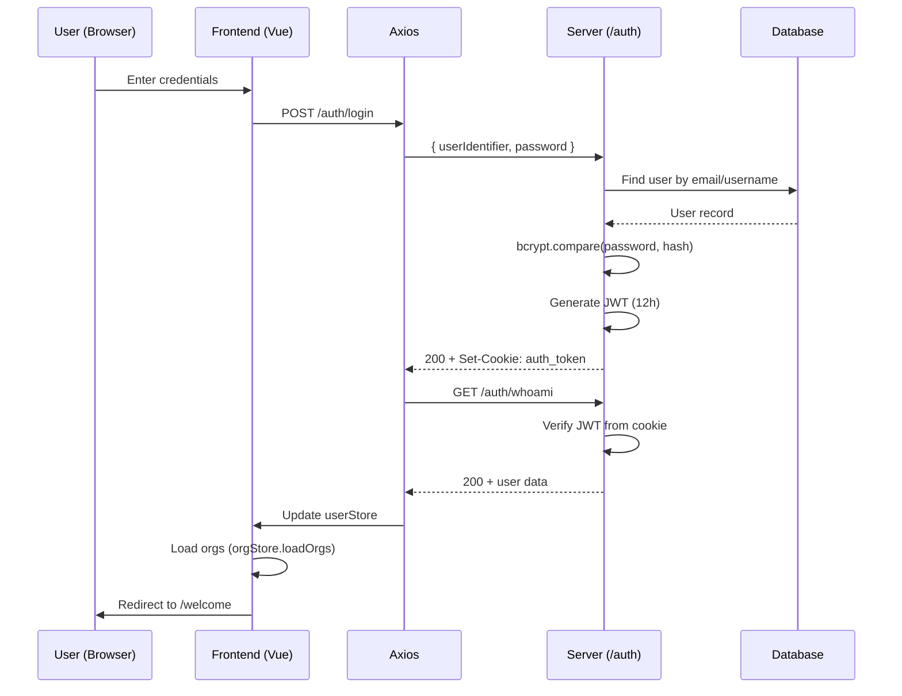
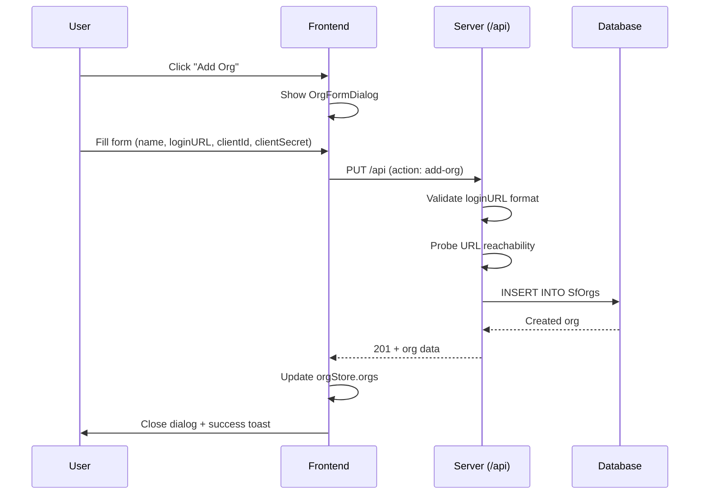
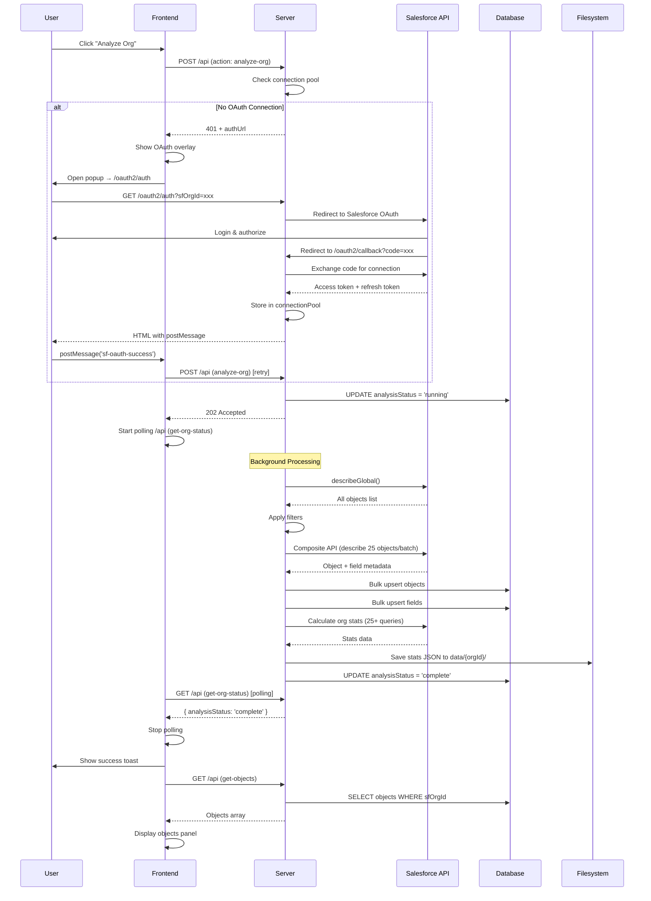
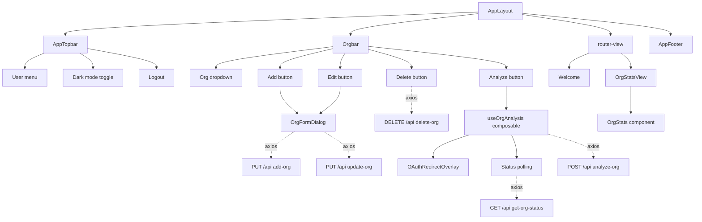
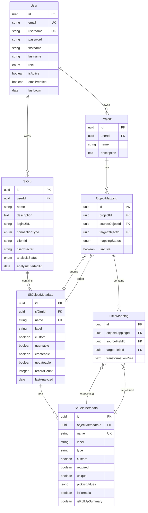

# SF Migrator - Current Architecture Documentation

> **Generated**: 2026-06-14  
> **Purpose**: Complete architectural overview of the SF Migrator application  
> **Status**: Active implementation as of June 2026

---

## Table of Contents

1. [System Overview](#system-overview)
2. [Technology Stack](#technology-stack)
3. [Application Architecture](#application-architecture)
4. [Frontend Architecture](#frontend-architecture)
5. [Backend Architecture](#backend-architecture)
6. [API Specification](#api-specification)
7. [Data Flow Diagrams](#data-flow-diagrams)
8. [Authentication & Authorization](#authentication--authorization)
9. [Salesforce Integration](#salesforce-integration)
10. [Database Schema](#database-schema)

---

## System Overview

**SF Migrator** is a full-stack web application designed to facilitate Salesforce-to-Salesforce data migrations. The application currently provides:

- **User Authentication**: Secure login/registration with JWT-based auth
- **Org Management**: Add, edit, delete, and manage multiple Salesforce orgs
- **OAuth Integration**: Secure OAuth2 connection to Salesforce orgs
- **Org Analysis**: Automated metadata retrieval and analysis
- **Org Statistics**: Detailed org health metrics and usage statistics

### Current Implementation Status

✅ **Completed Features**:
- User authentication and authorization
- Org CRUD operations
- OAuth2 Salesforce connection flow
- Metadata analysis (objects & fields)
- Org statistics calculation
- Real-time analysis status polling
- Migration Workspace UI (Phase 4 enhancements):
  - Object/field mapping interface with comprehensive metadata display
  - Multi-field search (label + API name + type)
  - Collapsible detail panels with distinctive visual styling
  - Record types and picklist values viewers
  - Dedicated metadata store with Map-based caching
  - Decoupled architecture (mappings vs. metadata)

🚧 **In Development**:
- Data migration execution
- Field mapping edit dialog
- Progress indicators for mapping completion
- Field type compatibility validation
- Bulk operations for mappings

---

## Technology Stack

### Frontend
| Technology | Version | Purpose |
|------------|---------|---------|
| **Vue.js** | 3.4.34 | Progressive JavaScript framework |
| **Vite** | 6.3.5 | Build tool and dev server (port 5173) |
| **Vue Router** | 4.4.0 | Client-side routing with guards |
| **Pinia** | 3.0.2 | State management with persistence |
| **Axios** | 1.8.4 | HTTP client with interceptors |
| **PrimeVue** | 4.3.3 | UI component library (Aura theme) |
| **TailwindCSS** | 3.4.6 | Utility-first CSS framework |
| **SCSS** | - | CSS preprocessor |

### Backend
| Technology | Version | Purpose |
|------------|---------|---------|
| **Node.js** | - | Runtime environment |
| **Express** | 4.21.2 | Web application framework |
| **Sequelize** | 6.37.7 | PostgreSQL ORM |
| **PostgreSQL** | - | Relational database |
| **jsforce** | 3.6.5 | Salesforce API integration |
| **JWT** | 9.0.2 | Token-based authentication |
| **bcrypt** | 6.0.0 | Password hashing |
| **dotenv** | 16.4.7 | Environment configuration |

### Development Tools
- **nodemon**: Auto-restart dev server
- **cross-env**: Cross-platform environment variables
- **sequelize-cli**: Database migrations
- **ESLint**: Code linting
- **Prettier**: Code formatting

---

## Application Architecture

### High-Level Architecture

```
┌───────────────────────────────────────────────────────────────┐
│                         CLIENT (Browser)                      │
│  ┌─────────────────────────────────────────────────────────┐  │
│  │                    Vue 3 SPA (Port 5173)                │  │
│  │  ┌────────────┐  ┌──────────┐  ┌───────────────────┐    │  │
│  │  │   Router   │  │  Stores  │  │   Components      │    │  │
│  │  │  (Guards)  │  │ (Pinia)  │  │  (Composition API)│    │  │
│  │  └────────────┘  └──────────┘  └───────────────────┘    │  │
│  │         │              │                  │             │  │
│  │         └──────────────┴──────────────────┘             │  │
│  │                        │                                │  │
│  │                 ┌──────▼────────┐                       │  │
│  │                 │ Axios Instance│                       │  │
│  │                 │ (Interceptors)│                       │  │
│  │                 └──────┬────────┘                       │  │
│  └────────────────────────┼────────────────────────────────┘  │
└────────────────────────────┼──────────────────────────────────┘
                             │ HTTP/HTTPS
                             │ (withCredentials: true)
┌────────────────────────────▼──────────────────────────────────┐
│                    SERVER (Port 3000)                         │
│  ┌─────────────────────────────────────────────────────────┐  │
│  │                   Express Application                   │  │
│  │  ┌───────────────────────────────────────────────────┐  │  │
│  │  │              Middleware Layer                     │  │  │
│  │  │  • CORS  • JSON Parser  • Request Tracer          │  │  │
│  │  └───────────────────────────────────────────────────┘  │  │
│  │                        │                                │  │
│  │  ┌─────────────────────┼─────────────────────────────┐  │  │
│  │  │          Routes Layer (Action-based)              │  │  │
│  │  │  /auth  │  /api (protected)  │  /oauth2           │  │  │
│  │  └─────────┼────────────────────┼────────────────────┘  │  │
│  │            │                    │                       │  │
│  │  ┌─────────▼────────────────────▼────────────────────┐  │  │
│  │  │              Services Layer                       │  │  │
│  │  │  • salesforceService  • metadataService           │  │  │
│  │  │  • orgStatsService    • filesystemService         │  │  │
│  │  └────────────────────────┬──────────────────────────┘  │  │
│  │                           │                             │  │
│  │  ┌────────────────────────▼──────────────────────────┐  │  │
│  │  │           Repositories Layer                      │  │  │
│  │  │  • userRepository     • orgRepository             │  │  │
│  │  │  • metadataRepository                             │  │  │
│  │  └────────────────────────┬──────────────────────────┘  │  │
│  │                           │                             │  │
│  │  ┌────────────────────────▼──────────────────────────┐  │  │
│  │  │              Models Layer (Sequelize)             │  │  │
│  │  │  User, SfOrg, Project, SfObjectMetadata, etc.     │  │  │
│  │  └────────────────────────┬──────────────────────────┘  │  │
│  └───────────────────────────┼─────────────────────────────┘  │
└────────────────────────────┼──────────────────────────────────┘
                             │
┌────────────────────────────▼───────────────────────────────────┐
│                       PostgreSQL Database                      │
│  Tables: Users, SfOrgs, Projects, SfObjectMetadata,            │
│          SfFieldMetadata, ObjectMappings, FieldMappings        │
└────────────────────────────────────────────────────────────────┘
                             │
┌────────────────────────────▼───────────────────────────────────┐
│                    Salesforce Orgs (via jsforce)               │
│  • OAuth2 Authentication  • Metadata API  • REST API           │
└────────────────────────────────────────────────────────────────┘
```

---

## Frontend Architecture

### Application Entry Point

**File**: `src/main.js`

```javascript
Vue App Initialization
  ↓
├─ Pinia Store (with persistence plugin)
├─ Vue Router (with navigation guards)
├─ PrimeVue (Aura theme, dark mode support)
├─ Toast Service
├─ Confirmation Service
└─ Mount to #app
```

### Routing Structure

**File**: `src/router/index.js`

| Route | Component | Layout | Auth Required | Purpose |
|-------|-----------|--------|---------------|---------|
| `/welcome` | Welcome.vue | AppLayout | ✅ | Landing page |
| `/org-stats` | OrgStatsView.vue | AppLayout | ✅ | Org statistics view |
| `/auth/login` | auth/Login.vue | None | ❌ | User login |
| `/auth/register` | auth/Register.vue | None | ❌ | User registration |
| `/auth/access` | auth/Access.vue | None | ❌ | Access denied page |

**Navigation Guard**: 
- Checks authentication via `isLoggedIn()` composable
- Redirects to `/auth/login` if not authenticated
- Public routes: `/auth/*` paths

### Component Hierarchy

```
App.vue (Root)
  └─ <router-view />
      │
      ├─ AppLayout.vue (for authenticated routes)
      │   ├─ AppTopbar.vue
      │   │   ├─ Logo
      │   │   ├─ Dark mode toggle
      │   │   ├─ User menu
      │   │   └─ Logout button
      │   │
      │   ├─ Orgbar.vue (Org selector & manager)
      │   │   ├─ Select org dropdown
      │   │   ├─ Add/Edit/Delete/Open/Analyze buttons
      │   │   ├─ OrgFormDialog.vue (Add/Edit modal)
      │   │   └─ OAuthRedirectOverlay.vue (OAuth flow)
      │   │
      │   ├─ <router-view /> (Page content)
      │   │   ├─ Welcome.vue
      │   │   └─ OrgStatsView.vue
      │   │       └─ OrgStats.vue (WIP - stats display)
      │   │
      │   └─ AppFooter.vue
      │
      └─ Auth Views (no layout)
          ├─ Login.vue (with FloatingConfigurator)
          ├─ Register.vue (with FloatingConfigurator)
          └─ Access.vue (with FloatingConfigurator)
```

### Active Components

**Layouts**:
- `layout/AppLayout.vue` - Main authenticated layout wrapper
- `layout/AppTopbar.vue` - Top navigation bar
- `layout/AppFooter.vue` - Footer
- `layout/AppConfigurator.vue` - Theme configurator

**Core Components**:
- `Orgbar.vue` - Org selector and management toolbar
- `OrgStats.vue` - Org statistics dashboard (partial implementation)
- `Welcome.vue` - Welcome screen
- `OAuthRedirectOverlay.vue` - OAuth authorization overlay
- `FloatingConfigurator.vue` - Theme config button (auth pages)

**Views**:
- `views/MigrationWorkspace.vue` - Object/field mapping interface
  - **Features**:
    - Source/target org selection with analysis status checks
    - Object dropdowns with multi-field search (label + API name)
    - Field dropdowns with multi-field search (label + API name + type)
    - Comprehensive metadata display (all database columns)
    - Collapsible detail panels with distinctive blue gradient styling
    - Record types viewer (modal with DataTable)
    - Picklist values viewer (modal with DataTable)
    - Field mapping creation (as-is, expression, constant types)
    - Mapping status tracking and management
  - **Architecture**:
    - Uses `metadataStore` for object/field caching
    - Uses `mappingStore` for mapping management
    - Decoupled metadata and mapping concerns
- `views/FieldMapping.vue` - Field mapping detail view (referenced but not active)

**Dialog Components**:
- `dashboard/OrgFormDialog.vue` - Unified add/edit org modal
- `dashboard/OrgOverview.vue` - Org analysis panel (WIP)

**Deprecated/Unused** (*.old.vue files):
- `Dashboard.vue.old`
- `dashboard/OrgList.old.vue`
- `dashboard/ObjectList.old.vue`
- `dashboard/FieldList.old.vue`
- (Various other .old.vue files - not in active use)

### State Management (Pinia Stores)

**File**: `src/stores/`

#### 1. userStore.js
```javascript
State:
  - isAuthenticated: boolean
  - email: string
  - username: string
  - serverDown: boolean (for error handling)

Actions:
  - setEmail(email)
  - setUsername(username)
  - setIsAuthenticated(bool)

Persistence: ✅ (localStorage)
```

#### 2. orgStore.js
```javascript
State:
  - orgs: Array<SfOrg>
  - selectedOrg: SfOrg | null
  - showEditOrgDialog: boolean
  - showAddOrgDialog: boolean

Actions:
  - loadOrgs() - Fetches all orgs for current user
  - setSelectedOrg(org)
  - deleteOrg(orgId)
  - getOrgStats(orgId)
  - closeEditOrgDialog()
  - closeAddOrgDialog()

Persistence: ✅ (localStorage)
```

#### 3. mappingStore.js
```javascript
State:
  - objectMappings: Array<ObjectMapping>
  - currentMapping: ObjectMapping | null
  - fieldMappings: Array<FieldMapping>
  - loading: boolean
  - error: string | null

Actions:
  - loadMappings(sourceOrgId, targetOrgId?) - Fetch object mappings
  - loadFieldMappings(objectMappingId) - Fetch field mappings
  - createMapping(sourceObjectId, targetObjectId)
  - createFieldMapping(data) - Create new field mapping
  - updateMapping(mappingId, updates)
  - updateFieldMapping(mappingId, updates)
  - deleteMapping(mappingId)
  - deleteFieldMapping(mappingId)
  - clearMappings() - Reset state

Persistence: ❌ (session-only, not persisted)
Purpose: Manages object and field mapping configurations
```

#### 4. metadataStore.js
```javascript
State:
  - objectsByOrg: Map<orgId, Array<SfObjectMetadata>>
  - fieldsByObject: Map<objectId, Array<SfFieldMetadata>>
  - selectedObjectDetails: SfObjectMetadata | null
  - selectedFieldDetails: SfFieldMetadata | null
  - loading: boolean
  - error: string | null

Actions:
  - loadObjects(orgId) - Fetch and cache objects
  - loadFields(objectId) - Fetch and cache fields
  - getObjects(orgId) - Retrieve from cache
  - getFields(objectId) - Retrieve from cache
  - setObjectDetails(object) - Store full metadata
  - setFieldDetails(field) - Store full metadata
  - clearCache() - Clear all cached data
  - clearOrgCache(orgId) - Clear cache for specific org

Persistence: ❌ (in-memory cache only)
Purpose: Memory-efficient metadata caching for mapping UI
Architecture: Decoupled from mappingStore, uses Map for O(1) lookups
```

#### 5. globalStore.js
```javascript
State: (empty)
Actions: (empty)

Status: Placeholder - not actively used
```

### Composables

**File**: `src/composables/`

#### 1. auth/useAuth.js
```javascript
Purpose: Authentication operations

Functions:
  - login(email, password)
      → POST /auth/login
      → GET /auth/whoami
      → Updates userStore
      → Loads orgs via orgStore

  - isLoggedIn()
      → GET /auth/whoami
      → Returns true/false
      → Used by router guard
```

#### 2. useOrgAnalysis.js
```javascript
Purpose: Org analysis workflow orchestration

State:
  - analyzingOrgId: ref(null)
  - objects: ref([])
  - selectedObject: ref(null)
  - fields: ref([])
  - hasAnalysis: ref(false)
  - showingOAuthOverlay: ref(false)
  - oauthOrgName: ref('')

Functions:
  - checkOrgAnalysis(orgId)
      → Checks if org has been analyzed
      → Loads objects if available

  - doAnalysis()
      → POST /api (action: analyze-org)
      → Starts polling for status
      → Handles OAuth redirect if needed

  - startPolling(orgId)
      → GET /api (action: get-org-status)
      → Polls every 2s until complete/failed
      → Shows toast on completion

  - triggerOAuthRedirect(authUrl, orgId)
      → Opens OAuth popup
      → Waits for postMessage
      → Handles completion/errors

  - stopPolling(orgId?)
      → Cleans up poll timers

  - resetState()
      → Clears analysis state
```

### API Client

**File**: `src/api/axiosInstance.js`

```javascript
Configuration:
  - baseURL: process.env.VITE_API_URL (http://localhost:3000)
  - withCredentials: true (sends cookies)
  - validateStatus: status < 500 (4xx handled as success)

Request Interceptor:
  - Generates unique X-Request-ID (8-char UUID)
  - Logs request: [requestId] method URL action

Response Interceptor:
  - Logs response: [requestId] status success
  - Logs errors with full context
  - Does NOT auto-redirect on 401 (handled by caller)

Headers:
  - Content-Type: application/json
  - X-Request-ID: <uuid>
  - action: <action-name> (for action-based routing)
  - orgid: <org-id> (for org-specific requests)
  - objectid: <object-id> (for object-specific requests)
```

---

## Backend Architecture

### Server Entry Point

**File**: `SERVER/src/server.js`

```javascript
Server Initialization
  ↓
├─ Load environment config (.env.{NODE_ENV})
├─ Configure CORS (FRONTEND_URL origin, credentials: true)
├─ JSON body parser
├─ Request tracer middleware
│
├─ Routes:
│   ├─ /auth (public)
│   ├─ /api (protected with authMiddleware)
│   └─ / (OAuth routes)
│
└─ Listen on PORT 3000
```

### Middleware Layer

**File**: `SERVER/src/middleware/`

#### 1. requestTracer.js
```javascript
Purpose: Request tracing and correlation

Functionality:
  - Generates/extracts X-Request-ID from headers
  - Stores requestId in AsyncLocalStorage
  - Available to all downstream code (logger)
  - Adds X-Request-ID to response headers
```

#### 2. authMiddleware.js
```javascript
Purpose: JWT authentication for protected routes

Process:
  1. Extracts auth_token from cookies
  2. Verifies JWT signature (JWT_SECRET)
  3. Decodes user data (id, email, username, role)
  4. Attaches req.user = { id, email, username, role }
  5. Calls next() if valid
  6. Returns 401 if invalid/expired/missing
```

### Routes Layer

**File**: `SERVER/src/routes/`

#### 1. auth.js (Public Routes)

| Method | Path | Action Header | Purpose |
|--------|------|---------------|---------|
| POST | `/auth/login` | `login` | User login with credentials |
| POST | `/auth/register` | - | User registration |
| GET | `/auth/whoami` | `whoami` | Validate auth token |
| GET | `/auth/logout` | - | Clear auth cookie |

**Login Flow**:
```
1. POST /auth/login { userIdentifier, password }
2. Find user by email OR username
3. Verify password with bcrypt
4. Generate JWT (12h expiration)
5. Set HttpOnly cookie: auth_token
6. Return { email, username }
```

**Registration Flow**:
```
1. POST /auth/register { email, password, firstname, lastname, username }
2. Validate: email format, username, password strength
3. Check existing user
4. Hash password (bcrypt, 10 rounds)
5. Create user in database
6. Return { email, username }
```

#### 2. api.js (Protected Routes - Action-Based)

**Action-based routing**: All API requests use the same HTTP paths but different `action` headers.

**GET `/api`** (action header required):

| Action | Headers | Purpose | Response |
|--------|---------|---------|----------|
| `get-orgs` | - | Get all orgs for user | Array<SfOrg> (credentials masked) |
| `get-objects` | `orgid` | Get objects for org | Array<SfObjectMetadata> |
| `get-fields` | `objectid` | Get fields for object | Array<SfFieldMetadata> |
| `get-org-status` | `orgid` | Get analysis status | { analysisStatus, analysisStartedAt, authUrl? } |
| `get-org-stats` | `orgid` | Get org statistics | Stats JSON object |

**POST `/api`** (action header required):

| Action | Body | Purpose | Response |
|--------|------|---------|----------|
| `analyze-org` | `{ orgId, options? }` | Start org analysis | 202 Accepted + background processing |
| `test-sf-connection` | `{ orgId }` | Test Salesforce connection | Connection status |

**PUT `/api`** (action header required):

| Action | Headers | Body | Purpose |
|--------|---------|------|---------|
| `update-org` | `orgid` | `{ name?, description?, loginURL?, clientId?, clientSecret? }` | Update org |
| `add-org` | - | `{ name, description, loginURL, clientId?, clientSecret? }` | Create new org |

**DELETE `/api`** (action header required):

| Action | Headers | Purpose |
|--------|---------|---------|
| `delete-org` | `orgid` | Delete org and all metadata |

**Analysis Flow** (`analyze-org`):
```
1. POST /api { orgId, options }
2. Verify OAuth connection exists (throws 401 if not)
3. Update analysisStatus = 'running'
4. Return 202 Accepted immediately
5. Background processing:
   a. metadataService.analyzeAndSaveOrg()
      - Fetch objects via describeGlobal
      - Filter objects (user prefs + hardcoded filters)
      - Batch describe objects via Composite API
      - Save to database (objects + fields)
   b. orgStatsService.calculateAndSaveOrgStats()
      - Run ~25 different statistics queries
      - Save to filesystem (data/{orgId}/timestamp_stats.json)
   c. Update analysisStatus = 'complete'
6. Frontend polls get-org-status to detect completion
```

#### 3. oauth.js (OAuth2 Flow)

| Method | Path | Purpose |
|--------|------|---------|
| GET | `/oauth2/auth?sfOrgId=<id>&returnTo=<url>` | Start OAuth flow |
| GET | `/oauth2/callback?code=<code>&state=<state>` | OAuth callback |

**OAuth2 Flow**:
```
Step 1: GET /oauth2/auth?sfOrgId=xxx
  ↓
1. Fetch org from database
2. Create OAuth2 session (jsforce.OAuth2)
3. Store oauth2 instance in memory map
4. Probe loginURL for reachability
5. Build authorizationUrl with state={ sfOrgId, returnTo }
6. Redirect browser to Salesforce

Step 2: Salesforce redirects to /oauth2/callback?code=xxx&state=xxx
  ↓
1. Parse state → { sfOrgId, returnTo }
2. Retrieve oauth2 session from map
3. Exchange code for connection (conn.authorize)
4. Store connection in connectionPool
5. Update org: analysisStatus = 'idle'
6. Return HTML that postMessages { type: 'sf-oauth-success' }
7. Frontend closes popup and triggers analysis
```

### Services Layer

**File**: `SERVER/src/services/`

#### 1. salesforceService.js

**Purpose**: Salesforce API integration via jsforce

**Connection Management**:
```javascript
connectionPool: Map<sfOrgId, Connection>
oauth2Map: Map<sfOrgId, OAuth2>

connectToOrg(sfOrgId)
  → Returns cached connection if valid
  → Throws OAuthRequiredError if no connection
  → Frontend redirects to /oauth2/auth

beginOAuth(sfOrgId, returnTo)
  → Creates OAuth2 instance
  → Returns authorization URL

completeOAuth(sfOrgId, code)
  → Exchanges code for connection
  → Stores in connectionPool
  → Returns user info

cancelOAuth(sfOrgId)
  → Cleans up pending OAuth session
```

**Metadata Retrieval**:
```javascript
describeGlobal(sfOrgId)
  → conn.describeGlobal()
  → Returns all sobjects (mapped to our format)

describeObjectMultiple(sfOrgId, objectNames[])
  → Uses Composite API (batch requests)
  → Up to 25 objects per request
  → Concurrency limit: 5 requests
  → Returns detailed object + field metadata

getRecordCounts(sfOrgId, objectNames[])
  → Composite API batch queries
  → SELECT COUNT() for each object
  → Returns { objectName: count } map
```

**Composite API Pattern**:
```javascript
// Batch 25 describe requests into 1 API call
// Repeat with 5 concurrent batches
// Massive performance gain: 500 objects in ~10 seconds vs 10+ minutes

Example:
  500 objects → 20 composite requests → 4 batches of 5 concurrent
```

#### 2. metadataService.js

**Purpose**: Orchestrates metadata analysis workflow

```javascript
analyzeAndSaveOrg(sfOrgId, options)
  ↓
1. Fetch all objects: sfService.describeGlobal(sfOrgId)
2. Apply filters:
   - User-provided object list (if any)
   - Hardcoded exclusions (config/objectsToExclude.js)
   - Pattern-based exclusions (regex)
3. Batch describe: sfService.describeObjectMultiple()
4. Save to database:
   - metadataRepo.bulkUpsertObjects(objects)
   - metadataRepo.bulkUpsertFields(fields)
5. Return { objectsAnalyzed: count }
```

**Filters Applied**:
- Hardcoded list: ActivityHistory, OpenActivity, etc.
- Pattern-based: /^.*Share$/, /^.*History$/, /^.*Feed$/

#### 3. orgStatsService.js

**Purpose**: Calculate org health statistics

```javascript
calculateAndSaveOrgStats(conn, orgId)
  ↓
Runs 25+ queries serially:
  - getNoUsers() → User count
  - getActiveUsersCheckbox() → Active % (checkbox)
  - getActiveUsersLast30Days() → Login activity
  - getActiveUsersLast90Days() → Login activity
  - getAccessPercent() → Desktop vs Mobile
  - getLimits() → Org limits (/limits REST endpoint)
  - getEntitlements() → Feature entitlements
  - getLicenseLimits() → License usage
  - getObjectLimits() → Per-object limits
  - getUnusedProfilesAndPS() → Unused profiles
  - getUsedProfilesAndPS() → Active profiles
  - getStorage() → Data storage by object
  - getCustomObjects() → Custom object list
  - getCustomFields() → Custom field list
  - getRecordTypes() → Record types
  - getApexTriggers() → Apex triggers
  - getApexClasses() → Apex classes
  - getFlows() → Flows
  - getProcessBuilderRules() → Process Builder
  - getWorkflowRules() → Workflow rules
  - getLWC() → Lightning Web Components
  - getAura() → Aura components
  - getVisualforce() → Visualforce pages
  - getDangerousProfiles() → Profiles with dangerous perms

Results saved to: data/{orgId}/{timestamp}_stats.json
```

#### 4. filesystemService.js

**Purpose**: Filesystem operations for stats storage

```javascript
saveOrgStatsToFile(orgId, stats)
  → Creates: SERVER/data/{orgId}/{timestamp}_stats.json
  → Returns: filepath

getLatestOrgStats(orgId)
  → Reads latest stats file (alphabetically sorted)
  → Returns: parsed JSON
```

### Repositories Layer

**File**: `SERVER/src/repositories/`

**Pattern**: Only repositories access Sequelize models directly

#### 1. userRepository.js

```javascript
findById(id)
findByEmail(email)
findByUsername(username)
create(userData)
update(id, userData)
updateLastLogin(id)
```

#### 2. orgRepository.js

```javascript
findById(id)
findByUserId(userId)
create(sfOrgData)
update(id, sfOrgData)
delete(id)
updateAnalysisStatus(id, status)
  → Also sets analysisStartedAt when status = 'running'
```

#### 3. metadataRepository.js

```javascript
findOrCreateObject(sfOrgId, objectData)
findOrCreateField(objectMetadataId, fieldData)
findObjectById(id, { includeFields? })
findObjectsByOrgId(sfOrgId, { includeFields? })
findFieldsByObjectId(objectMetadataId)
deleteObjectsByOrgId(sfOrgId)

bulkUpsertObjects(sfOrgId, objectDataArray)
  → Uses Sequelize bulkCreate with updateOnDuplicate
  → Upserts on conflict: [sfOrgId, name]

bulkUpsertFields(fieldDataArray)
  → Similar bulk upsert pattern
```

#### 4. mappingRepository.js

```javascript
// Not actively used yet (future object/field mapping feature)
```

### Models Layer

**File**: `SERVER/models/`

**Database**: PostgreSQL with UUID primary keys

#### Core Models

**User**:
```javascript
{
  id: UUID (PK)
  email: STRING (unique)
  username: STRING (unique)
  password: STRING (bcrypt hash)
  firstname: STRING
  lastname: STRING
  role: ENUM('user', 'admin')
  isActive: BOOLEAN
  emailVerified: BOOLEAN
  lastLogin: DATE
  resetPasswordToken: STRING
  resetPasswordExpires: DATE
}
```

**SfOrg**:
```javascript
{
  id: UUID (PK)
  name: STRING
  description: TEXT
  loginURL: STRING
  connectionType: ENUM('OAuth')
  clientId: STRING
  clientSecret: STRING
  userId: UUID (FK → User)
  analysisStatus: ENUM('idle', 'running', 'complete', 'failed', 'auth_required')
  analysisStartedAt: DATE
}
```


**SfObjectMetadata**:
```javascript
{
  id: UUID (PK)
  sfOrgId: UUID (FK → SfOrg)
  name: STRING (API name)
  label: STRING
  labelPlural: STRING
  custom: BOOLEAN
  customSetting: BOOLEAN
  queryable: BOOLEAN
  createable: BOOLEAN
  updateable: BOOLEAN
  deleteable: BOOLEAN
  triggerable: BOOLEAN
  ... (50+ Salesforce describe fields)
  recordCount: INTEGER
  lastAnalyzed: DATE
}
```

**SfFieldMetadata**:
```javascript
{
  id: UUID (PK)
  objectMetadataId: UUID (FK → SfObjectMetadata)
  name: STRING
  label: STRING
  type: STRING
  length: INTEGER
  precision: INTEGER
  scale: INTEGER
  custom: BOOLEAN
  required: BOOLEAN (nillable inverted)
  unique: BOOLEAN
  externalId: BOOLEAN
  calculated: BOOLEAN
  ... (40+ Salesforce field describe properties)
  picklistValues: JSONB (for picklists)
  isFormula: BOOLEAN (generated column)
  isRollUpSummary: BOOLEAN (generated column)
}
```

**ObjectMapping** (future):
```javascript
{
  id: UUID (PK)
  projectId: UUID (FK)
  sourceObjectId: UUID (FK)
  targetObjectId: UUID (FK)
  mappingStatus: ENUM
  isActive: BOOLEAN
}
```

**FieldMapping** (future):
```javascript
{
  id: UUID (PK)
  objectMappingId: UUID (FK)
  sourceFieldId: UUID (FK)
  targetFieldId: UUID (FK)
  transformationRule: TEXT
}
```

---

## API Specification

### Complete API Endpoint List

#### Authentication APIs (Public)

```http
POST /auth/login
Headers:
  action: login
Body:
  {
    "userIdentifier": "user@example.com",
    "password": "password123"
  }
Response 200:
  {
    "success": true,
    "message": "Login successful",
    "data": {
      "email": "user@example.com",
      "username": "username"
    }
  }
Sets Cookie: auth_token=<JWT>; HttpOnly; Path=/; Max-Age=43200
```

```http
POST /auth/register
Body:
  {
    "email": "user@example.com",
    "password": "SecurePass123!",
    "firstname": "John",
    "lastname": "Doe",
    "username": "johndoe"
  }
Response 201:
  {
    "success": true,
    "message": "Registration was successful",
    "data": {
      "email": "user@example.com",
      "username": "johndoe"
    }
  }
```

```http
GET /auth/whoami
Headers:
  action: whoami
Cookie: auth_token=<JWT>
Response 200:
  {
    "success": true,
    "message": "User is authenticated",
    "data": {
      "email": "user@example.com",
      "username": "johndoe"
    }
  }
Response 401: { "success": false, "message": "Unauthorized" }
```

```http
GET /auth/logout
Response 200:
  {
    "success": true,
    "message": "Logout successful"
  }
Sets Cookie: auth_token=; Max-Age=0
```

#### Org Management APIs (Protected)

```http
GET /api
Headers:
  action: get-orgs
  X-Request-ID: <uuid>
Cookie: auth_token=<JWT>
Response 200:
  {
    "success": true,
    "message": "Salesforce Orgs retrieved successfully",
    "data": [
      {
        "id": "uuid",
        "name": "Production Org",
        "description": "Main production org",
        "loginURL": "https://login.salesforce.com",
        "connectionType": "OAuth",
        "clientId": "**********",
        "clientSecret": "**********",
        "userId": "uuid",
        "analysisStatus": "complete",
        "analysisStartedAt": "2026-06-10T14:30:00Z"
      }
    ]
  }
```

```http
PUT /api
Headers:
  action: add-org
Body:
  {
    "name": "Sandbox Org",
    "description": "Development sandbox",
    "loginURL": "https://test.salesforce.com",
    "clientId": "3MVG...",
    "clientSecret": "ABC123..."
  }
Response 201:
  {
    "success": true,
    "message": "Salesforce Org added successfully",
    "data": { <org object> }
  }
Response 400: { "success": false, "message": "Login URL must start with https:// and end with .my.salesforce.com" }
```

```http
PUT /api
Headers:
  action: update-org
  orgid: <org-uuid>
Body:
  {
    "name": "Updated Name",
    "clientId": "new-client-id"
  }
Response 200:
  {
    "success": true,
    "message": "Salesforce Org updated successfully"
  }
```

```http
DELETE /api
Headers:
  action: delete-org
  orgid: <org-uuid>
Response 200:
  {
    "success": true,
    "message": "Salesforce Org deleted successfully"
  }
```

#### Org Analysis APIs (Protected)

```http
POST /api
Headers:
  action: analyze-org
Body:
  {
    "orgId": "uuid",
    "options": {
      "objectsToAnalyze": ["Account", "Contact"],
      "includeCustomOnly": false
    }
  }
Response 202:
  {
    "success": true,
    "message": "Analysis started",
    "data": {
      "analysisStatus": "running"
    }
  }
Response 401 (OAuth required):
  {
    "authUrl": "/oauth2/auth?sfOrgId=uuid"
  }
```

```http
GET /api
Headers:
  action: get-org-status
  orgid: <org-uuid>
Response 200:
  {
    "success": true,
    "message": "Org status retrieved",
    "data": {
      "analysisStatus": "complete",
      "analysisStartedAt": "2026-06-14T10:00:00Z"
    }
  }
Response 200 (auth required):
  {
    "data": {
      "analysisStatus": "auth_required",
      "authUrl": "/oauth2/auth?sfOrgId=uuid"
    }
  }
```

```http
GET /api
Headers:
  action: get-objects
  orgid: <org-uuid>
Query:
  ?includeFields=true
Response 200:
  {
    "success": true,
    "message": "Objects retrieved successfully",
    "data": [
      {
        "id": "uuid",
        "name": "Account",
        "label": "Account",
        "custom": false,
        "fields": [ <if includeFields=true> ]
      }
    ]
  }
```

```http
GET /api
Headers:
  action: get-fields
  objectid: <object-metadata-uuid>
Response 200:
  {
    "success": true,
    "message": "Fields retrieved successfully",
    "data": [
      {
        "id": "uuid",
        "name": "Name",
        "label": "Account Name",
        "type": "string",
        "required": true,
        "custom": false
      }
    ]
  }
```

```http
GET /api
Headers:
  action: get-org-stats
  orgid: <org-uuid>
Response 200:
  {
    "success": true,
    "message": "Metadata statistics retrieved successfully",
    "data": {
      "noUsers": 150,
      "activeUsersCheckbox": 85.5,
      "limits": [ ... ],
      "storage": [ ... ],
      "customObjects": [ ... ]
    }
  }
```

#### OAuth2 Flow APIs

```http
GET /oauth2/auth
Query:
  ?sfOrgId=<uuid>
  &returnTo=<url>
Process:
  1. Validates org exists
  2. Creates OAuth2 session
  3. Probes loginURL
  4. Redirects to Salesforce authorization URL
```

```http
GET /oauth2/callback
Query:
  ?code=<auth-code>
  &state=<json-state>
Process:
  1. Exchanges code for connection
  2. Stores in connection pool
  3. Returns HTML with postMessage script
Response (HTML):
  <script>
    window.opener.postMessage({
      type: 'sf-oauth-success',
      sfOrgId: 'uuid'
    }, origin);
    window.close();
  </script>
```

---

## Data Flow Diagrams

### 1. User Login Flow



### 2. Add Org Flow



### 3. Org Analysis Flow (Complete)



### 4. Component Interaction (Frontend)



### 5. Backend Service Layer Interaction

#### TODO fix, has a parse error.
```mermaid
graph LR
    A[API Routes] --> B{Action Router}
    
    B -->|analyze-org| C[metadataService]
    B -->|get-org-stats| D[filesystemService]
    B -->|test-connection| E[salesforceService]
    B -->|CRUD ops| F[Repositories]
    
    C --> E
    C --> G[metadataRepository]
    
    H[orgStatsService] --> E
    H --> D
    
    E --> I[jsforce Connection Pool]
    I --> J[Salesforce Org]
    
    F --> K[Sequelize Models]
    K --> L[(PostgreSQL)]
    
    D --> M[data/{orgId}/*.json]
```

---

## Authentication & Authorization

### JWT-Based Authentication

**Token Generation** (server):
```javascript
const token = jwt.sign(
  {
    id: user.id,
    email: user.email,
    username: user.username,
    role: user.role
  },
  process.env.JWT_SECRET,
  { expiresIn: '12h' }
);
```

**Token Storage**:
- **Backend**: HttpOnly cookie (prevents XSS)
- **Frontend**: Pinia stores user data (from /whoami), but NOT the token
- **Cookie name**: `auth_token`
- **Cookie flags**: 
  - HttpOnly (JS cannot access)
  - Secure (production only - HTTPS)
  - SameSite=Strict (production) / Lax (dev)
  - Max-Age=43200 (12 hours)

**Token Validation** (authMiddleware):
```javascript
1. Extract token from req.cookies.auth_token
2. Verify signature: jwt.verify(token, JWT_SECRET)
3. Decode payload → { id, email, username, role }
4. Attach to request: req.user = decoded
5. Call next() or return 401
```

**Protected Routes**:
- All `/api/*` routes require authentication
- `/auth/*` routes are public
- Router guard on frontend checks `isLoggedIn()` before navigation

### Authorization Patterns

**Current**: Simple role-based (user vs admin)
- All authenticated users can manage their own orgs
- No multi-tenancy or org-level permissions yet

---

## Salesforce Integration

### OAuth2 Implementation

**Pattern**: Username-Password with OAuth2 (jsforce Pattern 2)

**Why OAuth2 vs Session ID**:
- ✅ Automatic token refresh
- ✅ More secure (no hardcoded passwords)
- ✅ Follows Salesforce best practices
- ✅ Works with MFA/SSO

**Connection Pool**:
```javascript
Map<sfOrgId, jsforce.Connection>

- Keyed by org UUID
- Stores active connections
- Validated before use (conn.identity())
- Recreated via OAuth if invalid
```

**OAuth2 Configuration**:
```javascript
new jsforce.OAuth2({
  loginUrl: org.loginURL,        // https://login.salesforce.com or https://test.salesforce.com
  clientId: org.clientId,        // Connected App Consumer Key
  clientSecret: org.clientSecret,// Connected App Consumer Secret
  redirectUri: process.env.SF_REDIRECT_URI // http://localhost:3000/oauth2/callback
})
```

**Connected App Requirements**:
- OAuth Scopes: `full` (or `api refresh_token`)
- Callback URL: `http://localhost:3000/oauth2/callback` (dev)
- Enable OAuth2 Username-Password flow

### jsforce API Usage

**Metadata API**:
```javascript
// Global describe (all objects)
conn.describeGlobal()
  → { sobjects: [ { name, label, ... }, ... ] }

// Object + field describe (single)
conn.sobject('Account').describe()
  → { name, label, fields: [...], ... }

// REST API request
conn.request('/services/data/v65.0/limits')
  → Org limits JSON
```

**Composite API** (batch requests):
```javascript
conn.requestPost('/services/data/v65.0/composite', {
  compositeRequest: [
    {
      method: 'GET',
      url: '/services/data/v65.0/sobjects/Account/describe',
      referenceId: 'Account'
    },
    {
      method: 'GET',
      url: '/services/data/v65.0/sobjects/Contact/describe',
      referenceId: 'Contact'
    }
    // ... up to 25 requests
  ]
})
```

**SOQL Queries**:
```javascript
conn.query('SELECT Id, Name FROM Account LIMIT 10')
  → { totalSize, records: [...] }

// Streaming for large result sets
conn.query('SELECT ...')
  .on('record', (record) => { ... })
  .on('end', () => { ... })
  .run({ autoFetch: true, maxFetch: 4000 })
```

### Error Handling

**OAuthRequiredError**:
```javascript
class OAuthRequiredError extends Error {
  constructor(sfOrgId) {
    this.authUrl = `/oauth2/auth?sfOrgId=${sfOrgId}`;
  }
}

// Thrown by: salesforceService.connectToOrg()
// Caught by: API routes
// Returned as: 401 { authUrl }
// Handled by: Frontend triggers OAuth popup
```

**Common Salesforce Errors**:
- `INVALID_SESSION_ID` → Triggers OAuth reconnect
- `REQUEST_LIMIT_EXCEEDED` → Daily API limit reached
- Network timeouts → Retry with backoff

---

## Database Schema

### Entity Relationship Diagram



### Key Database Features

**UUIDs**: All primary keys use UUID v4
- Distributed-friendly
- No auto-increment conflicts
- Secure (non-guessable)

**Composite Unique Indexes**:
- `(sfOrgId, name)` on SfObjectMetadata
- `(objectMetadataId, name)` on SfFieldMetadata
- Enables efficient upserts

**Generated Columns**:
```sql
-- SfFieldMetadata
isFormula BOOLEAN GENERATED ALWAYS AS (
  calculated = true
) STORED

isRollUpSummary BOOLEAN GENERATED ALWAYS AS (
  type = 'summary'
) STORED
```

**JSONB Storage**:
- `picklistValues` in SfFieldMetadata
- Indexed for fast queries: `GIN (picklistValues)`

**Bulk Operations**:
```javascript
// Sequelize bulkCreate with upsert
SfObjectMetadata.bulkCreate(rows, {
  updateOnDuplicate: ['label', 'custom', 'queryable', ...],
  conflictAttributes: ['sfOrgId', 'name']
})
```

### Data Volume Estimates

**Typical Org**:
- Objects: 500-800 (100-150 custom)
- Fields per object: 50-200
- Total fields: 25,000-160,000
- Users: 50-500
- Analysis time: 10-60 seconds

**Large Enterprise Org**:
- Objects: 1,500-2,000
- Fields: 300,000+
- Analysis time: 2-5 minutes

---

## Future Enhancements

### Completed in Phase 4

1. **Migration Workspace** ✅:
   - ✅ Source/target org selection
   - ✅ Object mapping creation and management
   - ✅ Field mapping with transformations (as-is, expression, constant)
   - ✅ Comprehensive metadata display
   - ✅ Multi-field search (label + API name + type)
   - ✅ Collapsible detail panels
   - ✅ Record types and picklist values viewers
   - ✅ Dedicated metadata store with caching
   - ✅ Mapping validation
   - 🚧 Side-by-side object comparison (partial)

### Planned Features

2. **Data Migration**:
   - Bulk API integration
   - Record batching
   - Error handling & retry
   - Progress tracking
   - Rollback capability

3. **Advanced Analysis**:
   - Compatibility checker (source → target)
   - Field mapping suggestions (ML-based)
   - Data type conversion warnings
   - Dependency analysis

4. **UI Improvements**:
   - ~~Object/field search and filter~~ ✅ (completed)
   - ~~Metadata comparison view~~ ✅ (completed)
   - Mapping history and versioning
   - Export mapping templates
   - Field mapping edit dialog
   - Progress indicators for mapping completion
   - Bulk operations for mappings

5. **Performance**:
   - Incremental analysis (delta updates)
   - Background job queue (Bull/Redis)
   - Caching layer (Redis)
   - WebSocket for real-time updates

---

## Appendix

### Environment Variables

**Frontend** (`.env.development`, `.env.production`):
```bash
VITE_API_URL=http://localhost:3000
```

**Backend** (`SERVER/.env.development`, `SERVER/.env.production`):
```bash
# Server
PORT=3000
NODE_ENV=development
FRONTEND_URL=http://localhost:5173

# Database
DB_HOST=localhost
DB_PORT=5432
DB_NAME=sf_migrator_dev
DB_USER=postgres
DB_PASSWORD=password

# JWT
JWT_SECRET=your-secret-key-here
JWT_EXPIRATION=12h

# Salesforce OAuth
SF_REDIRECT_URI=http://localhost:3000/oauth2/callback
```

### Startup Commands

**Development** (PowerShell script):
```powershell
# startDevServers.ps1
Start-Job { cd SERVER; npm run dev }
Start-Job { npm run dev }
```

Or manually:
```bash
# Terminal 1 - Backend
cd SERVER
npm run dev

# Terminal 2 - Frontend
npm run dev
```

**Production Build**:
```bash
npm run build
# → Outputs to /dist
# Serve via Express static middleware or nginx
```

### File Structure Summary

**Active Files** (in use):
```
src/
  main.js, App.vue
  router/index.js
  stores/{userStore, orgStore, globalStore}.js
  composables/{useAuth, useOrgAnalysis}.js
  api/axiosInstance.js
  layout/{AppLayout, AppTopbar, AppFooter}.vue
  components/
    Orgbar.vue
    OrgStats.vue
    Welcome.vue
    OAuthRedirectOverlay.vue
    FloatingConfigurator.vue
    dashboard/OrgFormDialog.vue
    dashboard/OrgOverview.vue
  views/
    OrgStatsView.vue
    auth/{Login, Register, Access}.vue

SERVER/
  src/
    server.js
    middleware/{requestTracer, authMiddleware}.js
    routes/{auth, api, oauth, validator}.js
    services/{salesforceService, metadataService, orgStatsService, filesystemService}.js
    repositories/{userRepository, orgRepository, metadataRepository}.js
    lib/logger.js
    utils/{sendResponse, parseCookies, sfFieldMapper, sfObjectMapper, probeUrl, popupResultHtml}.js
  models/
    index.js
    {User, SfOrg, SfObjectMetadata, SfFieldMetadata, ObjectMapping, FieldMapping, MigrationJob}.js
  migrations/
    1-uuid-extension.js
    2-create-user.js
    3-create-project.js, 3-create-sforg.js
    4-create-sf-object-metadata.js
    5-create-sf-field-metadata.js
    7-create-object-mapping.js
    8-create-field-mapping.js
    9-create-migration-job.js
  config/config.cjs
  data/{orgId}/{timestamp}_stats.json
```

**Deprecated Files** (not in use):
```
src/views/Dashboard.vue.old
src/components/dashboard/*.old.vue
docs/{ARCHITECTURE.md, Migration.md, GoLive.md} (old, superseded by this doc)
```

---

**End of Documentation**
